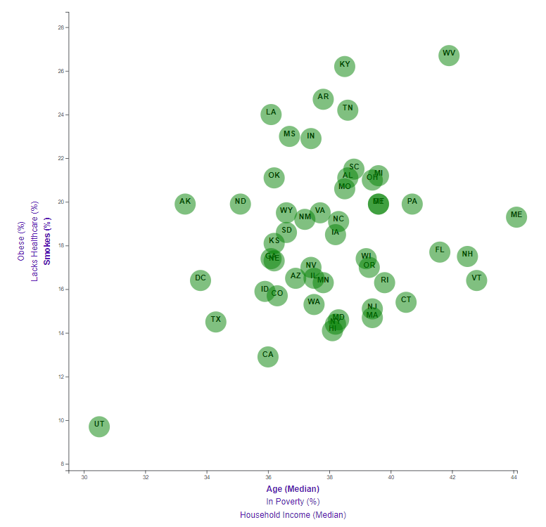

# D3-Challenge
20210317

This activity is to provide code that will create a dynamic scatter chart using JavaScript, HTML, CSS and D3.

The homework has 2 Levels.  Level 1 is required and Level 2 is Bonus.  Both Levels were completed.  Level 2 will be presented since it incorporates the chart identified in Level 1 along with the additional charts.  The scatter chart has 3 options on each of the x and y axis and the user is able to switch between the options and compare the data accordingly.

Link to the browser <a href="https://troyyoungblood.github.io/D3-Challenge/">D-3 Challenge</a>.  The chart has a hover feature that allows the user to hover over a point and see the respective data points.

Links to the code:

HTML code: [HTML Code](index.html) 
JavaScript code: [JavaScript Code](assets/js/app_bonus.js) 
CSS code: [CSS code](assets/css/style.css) 
D3 code: [D3 CSS code](assets/css/d3Style.css)

Example images

<h2>Correlations observed Between Health Risks and Age, Income</h2>
 

Six categories of information was plotted.  General observations per category will be presented first, followed  
by observations obtained when plotted against each other.

The first category is median age, Age (Median).  There are five states with a relatively similar value of 42(+/-)
years of age, median, for the highest value.  These states are Florida (FL), New Hampshire (NH), Vermont (VT),  
West Virginia (WV) and Maine (ME).  Maine has the highest median age of 44.1.  The state with the lowest age, median,
is Utah (UT) at 30.5.  This difference between this value and the next cluster of average age is approximately 3 years
of age.

Category 2 is percent in Poverty, In Poverty (%).  For the purpose of this data set, percent in poverty was 
defined in 2014, matching the dataset, as an annual reported income of $19,970 for a family of 3. For household sizes
less than or larger than 3, subtract or add $4,060 respectively. This value is established annually by the U.S.
Department of Health & Human Services, Office of the Assitant Secretary for Planning and Evaluation (ASPE).  As it 
relates to this chart, the chart reports percent of households falling below an established poverty line.  States with
more than 20% of their population living in population are New Mexico (NM) and Mississippi (MS), with Mississippi being the 
highest at greater than 21.5%.  Louisiana is just below 20% in 2014.  States with the lowest value are New Hampshire (NH)
and Maryland (MD) with New Hamphire the lowest at 9.2%.

Category 3 is median household income, Household Income (Median).  There are nine locations with an annual household
income greater than $65,000, with Maryland (MD) having the highest household median income at $73,971.  Seven of the locations
are in the northest, Maryland (MD), New Jersey (NJ), Connecticut (CT), Massachusetts (MA),  Washington D.C. (DC), New Hampshire
(NH), and Virginia (VA).  Maryland, Virginia, and Washington D.C. are primarily tied to national politicians. New Jersey
and Connecticut are tied to Wall Street. New Hampshire and Massachusetts are tied to activities around Boston. The remaining
two locations are outside of the contiguous US, Alaska (AK) and Hawaii (HI). There are five states with an annual household 
income less than $43,000.  Those states are Mississippi (MS), Arkansas(AR), West Virginia (WV), Alabama (AL) and Kentucky (KY).
Mississippi has the lowest value at  $39,680.

Category 4 is percent of the population who smokes, Smokes (%).  Utah (UT) has the lowest percentage of smokers at 9.7%
by a signifcant amount.  California (CA) being the next lowest at 12.9%. There are seven states with a percent smoking greater
than 23%.  Those states are Louisiana (LA), Mississippi (MS), Indiana (IN), Arkansas (AR), Tennessee (TN), Kentucky (KY), and 
West Virginia (WV).  West Virginia has the highest percentage at 26.7%.

Category 5 is percent lacking healthcare, Lacks Healthcare (%). Seventeen states have healthcare coverage at 90% (+/-) or higher.
In reference to the chart, this will be presented as 10% (+/-) or less lacking healthcare.  Massachusetts has the lowest value at 
4.6%. There are twelve states with coverage at 85% (+/-) or less.  This will be represented on the chart as lacking healthcare at 
15% or higher.  Texas (TX) has the highest percent lacking coverage at 24.9%. The next highest rate is Georgia at 20.9%. 
            

The last cateogry is percent obese, Obese (%).  The Center for Disease Control (CDC) defines obese as having a body mass index
(BMI) greater than 30.  BMI is determined by dividing a person's weight in kilograms by the square of their height in meters.
The chart represents the percentage of individuals in a designated location with a BMI greater than 30. Seven states have 25%
or less of their population with a BMI less than 30.  Colorado (CO) has the lowest percentage of its population with a BMI less
than 30 at 21.3%.  Six states have 33% or more of their population with a BMI or greater.  Those six states are Oklahoma (OK),
Alabama (AL), Louisiana (LA), Mississippi (MS), Arkansas (AR), and West Virginia (WV).  Arkansas has the highest value at 35.9%
West Virgina is at 35.7% and Mississippi at 35.5%.

Comparing the suite of median age data, Age (Median), vs Smokes, Lacks Healthcare and Obese, Lousiana (LA) and Mississippi (MS) 
consistently rank as one of the most deficient versus other states.   

Comparing the suite of percent in poverty, In Poverty (%), vs Smokes, Lacks Healthcare and Obese, Lousiana (LA), Mississippi (MS)
and New Mexico (NM) consistently rank as one of the most deficient versus other states. Of this group, Lousiana and Mississippi
appear in the upper right quadrant in each case following the trend also identified in the median age data.

Lastly, comparing the median household income, Household Income (Median) vs Smokes, Lacks Healthcare and Obese, there is a larger
set of states that rank poorly as previously noted with Louisiana (LA) and Mississippi (MS) in the cluster.

Images of initial rendering and date filtered response.

